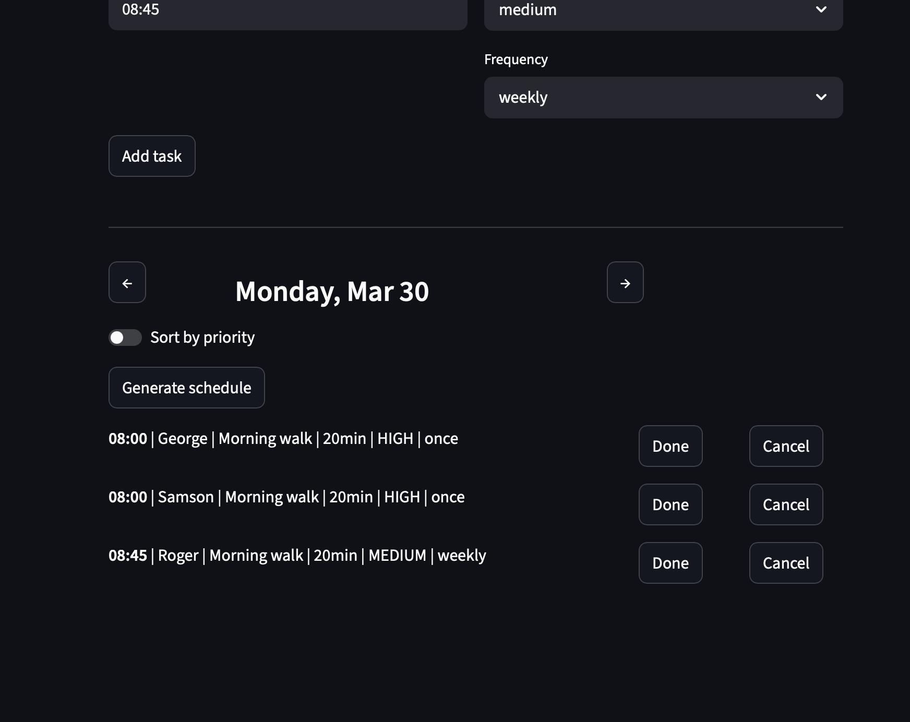

# PawPal+ (Module 2 Project)

You are building **PawPal+**, a Streamlit app that helps a pet owner plan care tasks for their pet.

## Scenario

A busy pet owner needs help staying consistent with pet care. They want an assistant that can:

- Track pet care tasks (walks, feeding, meds, enrichment, grooming, etc.)
- Consider constraints (time available, priority, owner preferences)
- Produce a daily plan and explain why it chose that plan

Your job is to design the system first (UML), then implement the logic in Python, then connect it to the Streamlit UI.

## What you will build

Your final app should:

- Let a user enter basic owner + pet info
- Let a user add/edit tasks (duration + priority at minimum)
- Generate a daily schedule/plan based on constraints and priorities
- Display the plan clearly (and ideally explain the reasoning)
- Include tests for the most important scheduling behaviors

## Smarter Scheduling

PawPal+ goes beyond basic task lists with built-in scheduling intelligence:

- **Sort by time** — daily schedule ordered chronologically (earliest first)
- **Sort by priority** — alternate view: high → medium → low, with time as tiebreaker
- **Filter tasks** — narrow by pet name and/or completion status
- **Conflict detection** — warns when two tasks for the same pet overlap at the same time
- **Recurring tasks** — completing a daily or weekly task auto-generates the next occurrence
- **Calendar navigation** — browse day-by-day with arrow controls and a Today button
- **Task completion** — mark tasks done from the schedule; completed tasks shown separately with strikethrough
- **Task cancellation** — remove tasks directly from the schedule
- **Conflict prevention** — blocks adding a task if the time slot is already taken for that pet

## Testing PawPal+

Run the test suite:

```bash
python -m pytest -v
```

We wrote **13 tests** covering core system behavior:

- **Task basics** — marking complete, adding tasks to pets
- **Sorting** — chronological ordering and priority-based ordering
- **Recurrence** — daily tasks generate tomorrow's copy, weekly tasks generate next week's, one-time tasks don't recur
- **Conflict detection** — flags same-pet same-time clashes, no false positives for different times
- **Filtering** — by pet name, by completion status
- **Edge cases** — empty pet (no tasks), completed tasks excluded from daily schedule

**Confidence Level:** 4 / 5

## Demo



## Getting started

### Setup

```bash
python -m venv .venv
source .venv/bin/activate  # Windows: .venv\Scripts\activate
pip install -r requirements.txt
```

### Suggested workflow

1. Read the scenario carefully and identify requirements and edge cases.
2. Draft a UML diagram (classes, attributes, methods, relationships).
3. Convert UML into Python class stubs (no logic yet).
4. Implement scheduling logic in small increments.
5. Add tests to verify key behaviors.
6. Connect your logic to the Streamlit UI in `app.py`.
7. Refine UML so it matches what you actually built.
